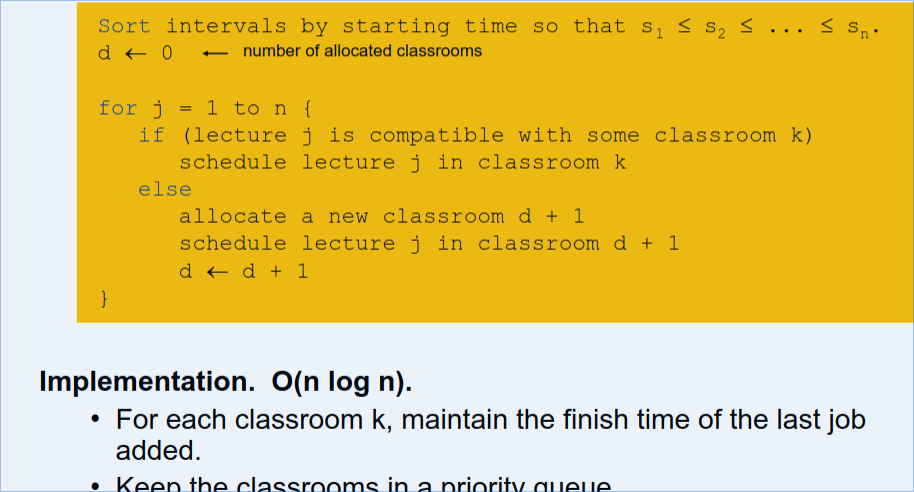
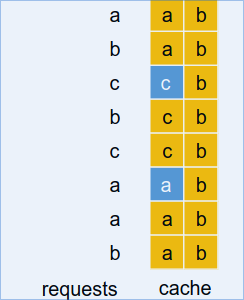
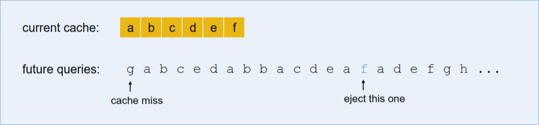
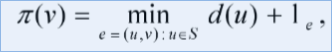

# CSE 551 Notes
# Module 1

# Module 2
## Interval Scheduling
Job j starts at s~j~ and finished at f~j~

Two jobs are compatible if they don't overlap.

Goal: find max subset of mutually compatible jobs

There are four different aspects of the jobs that we can consider, 
* ~~Earliest Start Time~~
* Earliest Finish Time
* ~~Shortest Interval~~
* ~~Fewest Conflicts~~

Those three above break with greedy method, as shown below:

We can solve this by ordering jobs by finish times first so that f1 $\lt$ f2 $\lt$ f3 and so on..

implementation:

It says O(n log n) time, because though the algorithm itself only take n time, we have to sort the finish times first, and best case of sorting is always log n.

## Interval Partitioning

Lecture j starts at s_j and finished at f_j, and the **goal** is to find the **minimum number of classrooms to schedule all lectures, so that no two occur at same time in same room.**

Goal: to find the minimum number of classrooms (or servers) to schedule all the lectures (or jobs), so that no two occur at the same time in the same room.

into this:

### Observations
- The *depth* of a set of open intervals is the maximum number of intervals that contain any given time.
- Number of classrooms needed is $\ge$ depth.
- This is obvious, because if we have x number of classes that are at a certain time, we can't use less than x classrooms in an optimal solution.

#### Greedy Algorithm
In order to solve this problem with a greedy algorithm template, we can consider lectures in order of start time, and assign lectures to any compatible classroom.

Here we can see this is also done in O(n log n) time, we have to sort in the beginning so log n, and we iterate through only one pass of n, so n log n is the complexity again here.

## Scheduling to Minimize Lateness

- Single resource processes one job at a time.
- Job j requires t_j units of processing time and is due at  time d_j.
- If j starts at times s_j, it finishes at time f_j = s_j + t_j
- **Lateness** l_j = max(0, f_j - d_j)
- **Goal** schedule all jobs to minimize maximum lateness L = max l_j

**Greedy Template** We need to consider jobs in a certain order. 

- ~~Shortest Processing Time~~ t_j

- ~~Smallest Slack~~ d_j - t_j

- Earliest Deadline First d_j

### Observations

- There exists an optimal schedule with no idle time (greedy schedule)
- An **inversion** is schedule S is a pair of jobs i and j where the deadline of i is before the deadline of j,  but j is scheduled before i
- There are no **inversions** in the greedy schedule.
- If a schedule (with no idle time) has an inversion, it has one with a pair of inverted jobs scheduled consecutively.

Swapping two adjacent, inverted jobs reduces the number inversions by one and does not increase the max lateness.

## Greedy Analysis Strategies

- **Greedy algorithm stays ahead** - after each step of algo, its solution is at least as good as any other algorithms
- **Exchange argument** - gradually transform any solution to on found by greedy algorithm without hurting quality
- **Structural** - Determine bound asserting that every possible solution must have certain value, show that algo always achieves this bound.

## Optimal Offline Caching

- Cache with capacity to store k items.
- Sequence of m item request d_1, d_2, ..., d_m.
- Cache hit: item already in cache when requested.
- Cache miss: item not already in cache when requested: must bring requested item into cache, and evict some existing item, if full.

**Goal** Eviction schedule that minimizes number of cache misses.

Ex. k = 2, initial cache = ab, requests: a, b, c, b, c, a, a, b

**Optimal Eviction Schedule** : 2 cache misses.

Basically the question is which item to evict at each request, in order to ensure that the number of cache misses are minimal.

* Optimal Solution

**Farthest in the Future**, evict item in the cache that is not requested until farthest in the future.

A **reduced** schedule is a schedule that only inserts an item into the cache in which that item is requested. We can transform an unreduced schedule into a reduced one with no more misses than it had before.

Online vs Offline Algorithms

- Offline: full sequence of requests is known a priori.
- Online: requests are not known in advance.

**LIFO** evict page brought in more recently.
**LRU** evict page whose most recent access was earliest.

^ Neither are as optimal as Farthest in the Future (FF), which is basis for understanding and analyzing online algorithms. LRU is k-competitive, and LIFO is arbitrarily bad.

## Further Examples of Greedy Algorithms

### Shortest Path Problem

**Shortest Path Network**
- Directed Graph G =(V, E)
- Source s, destination t
- Length l_e = length of edge e

**Shortest Path Problem**: find shortest directed path from s to t.

### Dijkstra's Algorithm
- Maintain a set of explored nodes S for which we have determined shortest path distance d(u) from s to u.
- Initialize S = {s}, d(s) = 0.
- Keep choosing an unexplored node v that minimizes 

and add v to S, and set d(v) = $\pi$(v)

### Minimum Spanning Tree

### Applications
