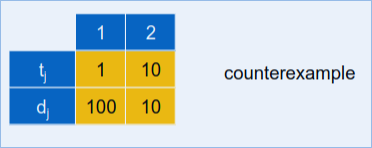

# CSE 551 Notes

# Module 2
## Interval Scheduling
Job j starts at s~j~ and finished at f~j~

Two jobs are compatible if they don't overlap.

Goal: find max subset of mutually compatible jobs

There are four different aspects of the jobs that we can consider, 
* ~~Earliest Start Time~~
* Earliest Finish Time
* ~~Shortest Interval~~
* ~~Fewest Conflicts~~

Those three above break with greedy method, as shown below:

We can solve this by ordering jobs by finish times first so that f1 $\lt$ f2 $\lt$ f3 and so on..

implementation:

It says O(n log n) time, because though the algorithm itself only take n time, we have to sort the finish times first, and best case of sorting is always log n.

## Interval Partitioning

Lecture j starts at s_j and finished at f_j, and the **goal** is to find the **minimum number of classrooms to schedule all lectures, so that no two occur at same time in same room.**

Goal: to find the minimum number of classrooms (or servers) to schedule all the lectures (or jobs), so that no two occur at the same time in the same room.

into this:

### Observations
- The *depth* of a set of open intervals is the maximum number of intervals that contain any given time.
- Number of classrooms needed is $\ge$ depth.
- This is obvious, because if we have x number of classes that are at a certain time, we can't use less than x classrooms in an optimal solution.

#### Greedy Algorithm
In order to solve this problem with a greedy algorithm template, we can consider lectures in order of start time, and assign lectures to any compatible classroom.

Here we can see this is also done in O(n log n) time, we have to sort in the beginning so log n, and we iterate through only one pass of n, so n log n is the complexity again here.

## Scheduling to Minimize Lateness

- Single resource processes one job at a time.
- Job j requires t_j units of processing time and is due at  time d_j.
- If j starts at times s_j, it finishes at time f_j = s_j + t_j
- **Lateness** l_j = max(0, f_j - d_j)
- **Goal** schedule all jobs to minimize maximum lateness L = max l_j

**Greedy Template** We need to consider jobs in a certain order. 

- ~~Shortest Processing Time~~ t_j

- Earliest Deadline First d_j
- ~~Smallest Slack~~ d_j - t_j

- 
